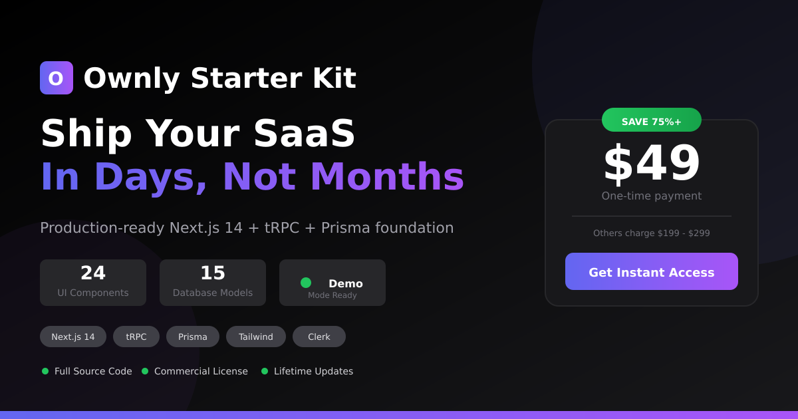
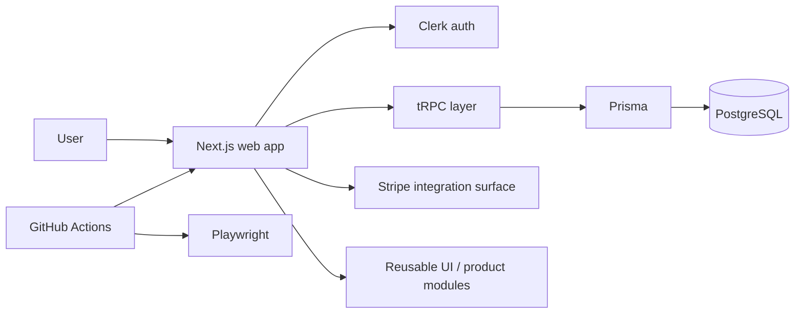

# Ownly — Reusable SaaS Starter Foundation

A reusable full-stack SaaS foundation for teams that want to start from working product infrastructure instead of rebuilding common application plumbing.

**Live demo:** https://ownly-kit.vercel.app



[](https://github.com/wizelements/Ownly/actions/workflows/ci.yml)
[](https://github.com/wizelements/Ownly/actions/workflows/codeql.yml)

> **Status:** Retained reusable product asset. The demo returned HTTP 200 on **October 7, 2026**. This repository is intentionally described by verified implementation rather than unsupported customer quotes, time-saved claims, or blanket “production-ready” language.

## What it provides

Ownly packages recurring SaaS concerns into a monorepo that can be adapted for new products:

- Next.js application shell and dashboard surfaces;
- Clerk authentication integration;
- tRPC client/server patterns;
- Prisma data layer with PostgreSQL-oriented schema;
- reusable UI and form patterns;
- Stripe integration dependencies/patterns;
- shared packages through Turborepo;
- Playwright browser tests;
- CI, CodeQL, scheduled E2E, and preview-deployment workflows.

It is a **foundation**, not a finished hosted business.

## Architecture



## Repository structure

```text
Ownly/
├── apps/
│   └── web/              # Next.js application
├── packages/
│   ├── database/         # Prisma schema/client
│   └── ...               # Shared packages
├── e2e/                  # Browser/API verification
├── .github/workflows/    # CI, CodeQL, preview, scheduled E2E
└── docs/                 # Supporting product documentation
```

## Verified technology baseline

| Layer | Current repository evidence |
| --- | --- |
| Framework | Next.js 14.1 + React 18 |
| API | tRPC 10 |
| Data | Prisma + PostgreSQL-oriented schema |
| Authentication | Clerk integration |
| UI | Tailwind CSS + Radix-based components |
| Payments | Stripe libraries/integration patterns |
| Monorepo | Turborepo + pnpm workspaces |
| Verification | CI, Playwright E2E, URL checks, Lighthouse workflow |
| Security scanning | GitHub CodeQL workflow |

## Clean setup

### Requirements

- Node.js 20+
- pnpm 8+
- PostgreSQL for database-backed development

```bash
git clone https://github.com/wizelements/Ownly.git
cd Ownly
pnpm install --frozen-lockfile
cp .env.example .env.local
pnpm db:push
pnpm db:seed
pnpm dev
```

Use demo/development configuration only as documented by the current code. Do not treat development bypasses as production authentication.

## Quality gates

Primary repository checks include:

```bash
pnpm lint
pnpm type-check
pnpm test
pnpm test:urls
pnpm test:e2e:chromium
pnpm build
```

The CI workflow also runs multi-browser E2E on main pushes and a non-blocking dependency audit. CodeQL is configured separately.

A badge indicates workflow state, not product fitness for a specific customer's production requirements.

## Security

See [SECURITY.md](SECURITY.md).

Applications derived from Ownly inherit responsibility for their own:

- authorization model and tenancy boundaries;
- production secrets;
- Stripe/webhook verification;
- database backups/migrations;
- privacy/data-retention obligations;
- monitoring and incident response.

A starter kit cannot prove those controls for an application that has not been built yet.

## License

Ownly uses a **commercial source license**, not an open-source license. See [LICENSE](LICENSE) before reuse or distribution.

The license file currently contains a governing-law placeholder. That legal/business choice should be finalized before relying on the license for new commercial distribution.

## Known limitations / boundaries

- This repository is a reusable foundation, not a guarantee that every derived application is production-ready.
- Production Clerk, Stripe, database, and deployment configuration require real external accounts/credentials.
- Security and compliance requirements vary by the product built from the starter.
- Prior marketing copy contained example testimonials and quantified value claims that were not supported by repository evidence; those claims are intentionally not used here.
- Commercial license jurisdiction remains an explicit business/legal decision to finalize.

## Business value

Ownly is reusable delivery leverage: common SaaS infrastructure can be carried forward instead of rebuilt for every client or product. Its value is measured by **reduced repeated implementation work and faster path to application-specific features**, with actual savings measured per engagement rather than invented in advance.

---

**Cod3Black Agency / wizelements**  
**Last portfolio verification:** October 7, 2026
